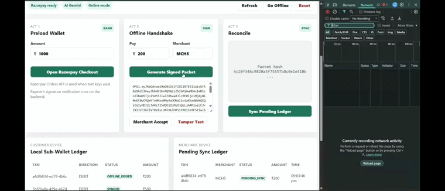
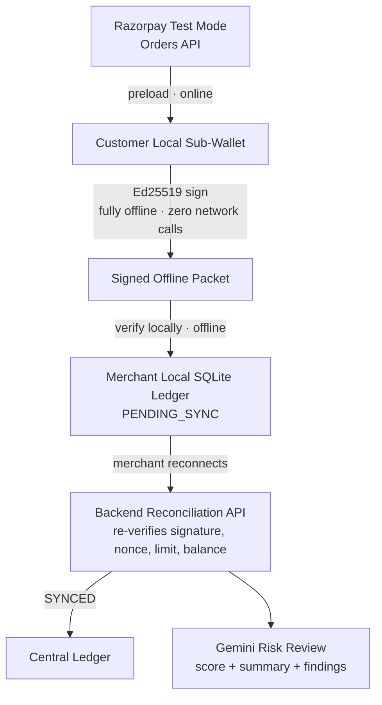
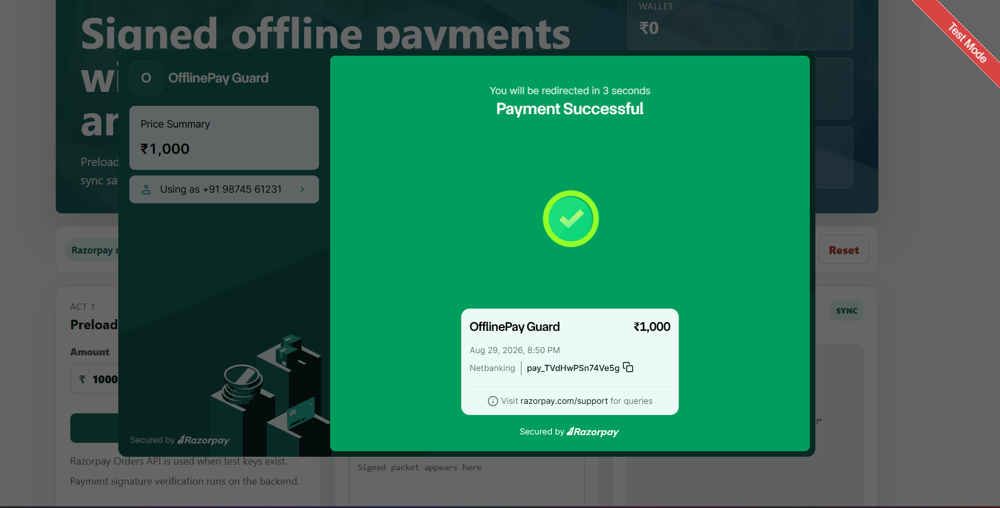
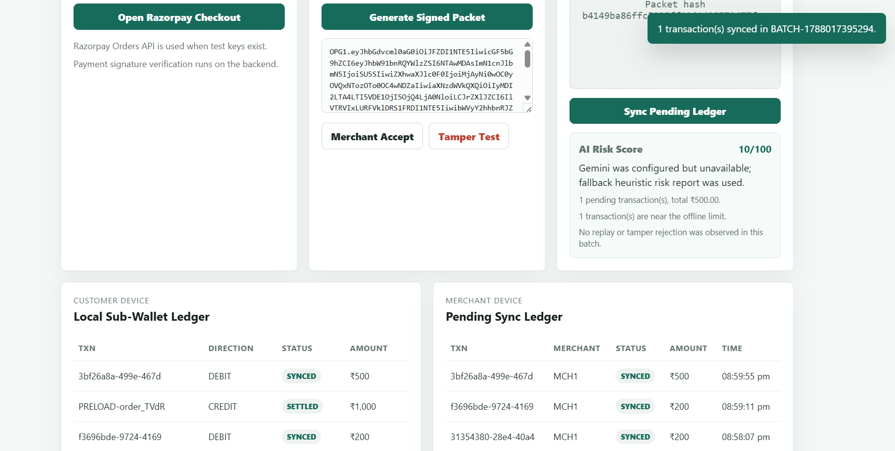
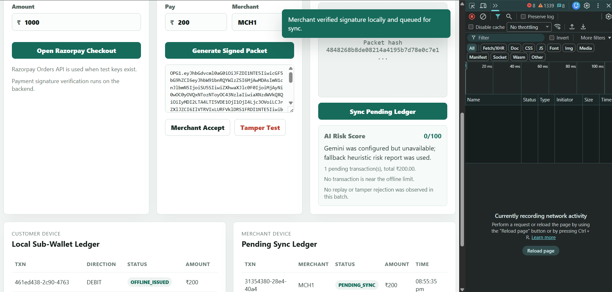

<div align="center">

# 🔒 OfflinePay Guard

### The network can drop. The signature can't.


**[🚀 Live Demo](https://offlinepay-guard.onrender.com) &nbsp;·&nbsp; [🎥 6-Min Demo Video](https://youtu.be/KEZnwmjDntQ) &nbsp;·&nbsp; [📄 Submission Notes](docs/SUBMISSION.md)**

</div>

<br>

<p align="center">
  
  <br>
  <sub><em>↑ Wifi is off. Network tab is empty. The payment still goes through.</em></sub>
</p>

<br>

> [!TIP]
> **In 30 seconds:** When the network drops, digital payments fail and cash takes over — even for something completely legitimate. **OfflinePay Guard** lets a customer sign a payment with on-device Ed25519 cryptography, entirely in-browser, with **zero network calls**. The merchant verifies it locally too. When they reconnect, the server independently **re-verifies everything from scratch** before settling — and Gemini flags anything suspicious in the batch. The customer never has to go back online for their payment to count. Only the merchant does, eventually.

**Jump to:** [Architecture](#-architecture) • [What Broke](#-what-broke-and-how-we-fixed-it) • [Security Model](#-security-model) • [AI Layer](#-ai-layer) • [Setup](#-setup) • [Real vs. Simulated](#-whats-real-vs-whats-simulated)

---

## 🧩 Why This Matters

Digital payments are excellent — until the network disappears. Small merchants, rural stores, event counters, transport points, campus canteens, and crowded markets face this constantly. When UPI or card flows fail, cash quietly becomes the fallback, even for a payment that's otherwise entirely legitimate.

OfflinePay Guard explores a safer middle path for low-value offline payments:

| | |
|---|---|
| 💳 | Preload money into a wallet while online |
| 🚫 | Enforce a strict offline transaction limit |
| ✍️ | Sign each offline IOU with a device-generated key |
| 📴 | Let merchants verify packets **without any internet** |
| 🔁 | Block replay attacks with nonce history |
| ✅ | Sync and re-verify everything, for real, once reconnected |
| 🤖 | Use AI to explain risk during reconciliation |

The customer's side is fully self-contained — once a packet is signed and handed over, they never need to reconnect for that payment to count. Only the merchant eventually needs to come back online to settle.

---

## 🔧 What Broke, And How We Fixed It

Building this surfaced real failures — each one forced an actual redesign, not a patch.

| Problem | Fix |
|---|---|
| **Backend-dependent signing** — offline payment signing initially happened server-side, so the app silently needed internet during the *"offline"* step, defeating the entire purpose. | Moved key generation and Ed25519 signing entirely into the browser via the Web Crypto API. The private key never leaves the device, and signing needs zero network calls. |
| **Signature mismatches** — once client and server sign/verify independently, even a different JSON key order broke validation. | Built a canonical JSON serializer (sorted keys, deterministic output) used identically on both sides. |
| **Trusting the client too much** — early versions risked accepting whatever the offline packet claimed. | Server now re-verifies every signature, nonce, and limit from scratch during sync. Client-side checks are never taken on faith. |
| **Replay attacks** — the same signed packet could be resubmitted as a "new" payment. | Nonce tracking rejects any packet whose nonce has already been seen. |

---

## 🗺 Architecture



Everything inside the offline boundary — signing and merchant verification — runs entirely client-side. The server is never consulted until the merchant syncs, and even then, it never trusts what the client already checked.

<p align="center">
  
  <br><sub><em>Act 1 — Preloading the wallet via real Razorpay Test Mode checkout</em></sub>
</p>

<p align="center">
  
  <br><sub><em>Act 3 — Server re-verification and the Gemini-generated risk report</em></sub>
</p>

---

## ✨ Features

- Razorpay Test Mode preload using Orders API
- Razorpay Checkout integration
- Backend verification of Razorpay payment signatures
- Local SQLite wallet and merchant ledgers
- Offline signed payment packets using Ed25519, signed entirely in-browser
- Merchant-side signature validation, also fully offline
- Nonce-based replay protection
- Tamper rejection
- Pending sync state with `PENDING_SYNC` and `SYNCED`
- Gemini AI risk report after reconciliation
- Local heuristic risk fallback if Gemini is not configured
- Safe `.env` based secret handling
- Single local app URL for fast judging/demo

## 🛠 Tech Stack

- Node.js 24 · Express · TypeScript
- Node's built-in SQLite
- Razorpay Test Mode APIs
- Gemini API
- HTML/CSS/JavaScript frontend served by Express
- Ed25519 signatures via the Web Crypto API (client) and Node crypto (server)

## 📁 Project Structure

```text
.
├── client/
│   └── static/              # Judge-facing frontend
├── server/
│   └── src/                 # Express API, crypto, DB, Razorpay, AI risk
├── docs/
│   ├── SUBMISSION.md        # Buildathon submission notes
│   └── screenshots/         # GIF + screenshots referenced above
├── .env.example             # Safe template only
├── .gitignore
├── package.json
└── README.md
```

---

## 🔐 Security Model

OfflinePay Guard uses a signed IOU model. Each offline packet contains:

`user ID` · `merchant ID` · `amount` · `currency` · `nonce` · `issue timestamp` · `expiry timestamp` · `previous wallet balance` · `device key ID` · `Ed25519 signature`

**Merchant validation checks:** packet format, transaction amount limit, merchant binding, expiry, user public key, Ed25519 signature, nonce replay history.

**Sync validation** repeats every signature check before inserting into the central ledger. Nothing the client already checked is taken on faith.

## 🤖 AI Layer

Gemini reviews reconciliation batches and returns a **risk score**, a **short summary**, and **specific findings** — flagging duplicate nonces, replay attempts, tampered payloads, near-limit transactions, and rejected sync rows.

If `GEMINI_API_KEY` is missing, a deterministic local heuristic takes over —
`min(95, rejectedSignals × 25 + highValueTxns × 10)` — so the risk panel always returns a real, explainable score instead of a placeholder.

---

## ⚙️ Setup

```bash
npm install
copy .env.example .env
```

Paste your own test keys into `.env`:

```env
PORT=8787
CLIENT_ORIGIN=http://localhost:5173

RAZORPAY_KEY_ID=rzp_test_your_key_id_here
RAZORPAY_KEY_SECRET=your_test_secret_here

GEMINI_API_KEY=your_gemini_key_here
GEMINI_MODEL=gemini-2.5-flash

OFFLINE_TXN_LIMIT_PAISE=50000
OFFLINE_WALLET_CAP_PAISE=200000
DEMO_ALLOW_SIMULATED_PRELOAD=true
```

```bash
npm start
```

Open **http://localhost:8787** · Health check at **http://localhost:8787/api/health**

> **API Key Safety:** use only `rzp_test_...` keys, never `rzp_live_...`. `.env` is git-ignored and must never be committed.

---

## 🎬 Demo Flow

```text
ACT 1 — PRELOAD
Open Razorpay Checkout → Netbanking → dummy details (9876543210 / test@example.com)
→ complete test payment → wallet balance increases → click "Go Offline"

ACT 2 — OFFLINE PAYMENT
Amount ₹200 → Merchant MCH1 → "Generate Signed Packet" → signed packet appears
→ "Merchant Accept" → PENDING_SYNC row created
→ Accept the same packet again → replay blocked
→ "Tamper Test" → Accept → signature validation fails

ACT 3 — RECONCILIATION
"Go Online" → "Sync Pending Ledger" → backend re-verifies every signature
→ rows become SYNCED → Gemini generates the AI risk analysis
```

<p align="center">
  
  <br><sub><em>Act 2 — Signed packet generation, replay block, and tamper rejection, all offline</em></sub>
</p>

**Razorpay Test Checkout tips:** prefer Netbanking (avoids card restrictions). Use `Test User` / `test@example.com` / `9876543210`. Never enter a real OTP — if one appears, you've used a real number by mistake; restart with dummy details.

---

## 📡 API Endpoints

```text
GET  /api/health
GET  /api/config
GET  /api/state
POST /api/preload/create
POST /api/preload/confirm
POST /api/offline/create-payment
POST /api/merchant/accept
POST /api/sync/merchant
POST /api/demo/reset
```

**Verification:** `npm run check` → TypeScript, client syntax, and build all pass. `npm run build` for a production build.

---

## ✅ What's Real vs. ⚗️ What's Simulated

| ✅ Real | 🧪 Simulated |
|---|---|
| Razorpay Orders API call | Production bank account lock |
| Razorpay Checkout integration | Actual regulated settlement |
| Razorpay payment signature verification | PSP-grade device attestation |
| SQLite persistence | Hardware-backed private key storage |
| Offline packet generation, signed client-side | Dispute and refund operations |
| Ed25519 verification, client **and** server | |
| Replay blocking | |
| Sync state transitions | |
| Gemini risk analysis | |

---

## 🔭 Future Scope

- Hardware-backed secure element for private keys
- QR/audio/NFC local transmission
- Merchant app as an Android PWA
- Risk thresholds configurable per merchant
- Settlement dashboard for operators
- Multi-device wallet recovery
- Formal audit log exports
- Partner-bank or PSP integration for regulated deployment

---

<div align="center">

## 💡 The Pitch

OfflinePay Guard isn't trying to replace UPI. It's answering one focused question:

**"What should happen when a legitimate low-value payment needs to work, but the network does not?"**

The prototype answers with a constrained offline wallet, cryptographic IOUs, merchant-local verification, delayed reconciliation, and AI-assisted risk review — built to fail safely. High amounts are rejected. Tampered packets fail. Duplicates are blocked. Every offline payment is re-verified before it ever touches the ledger.

</div>
